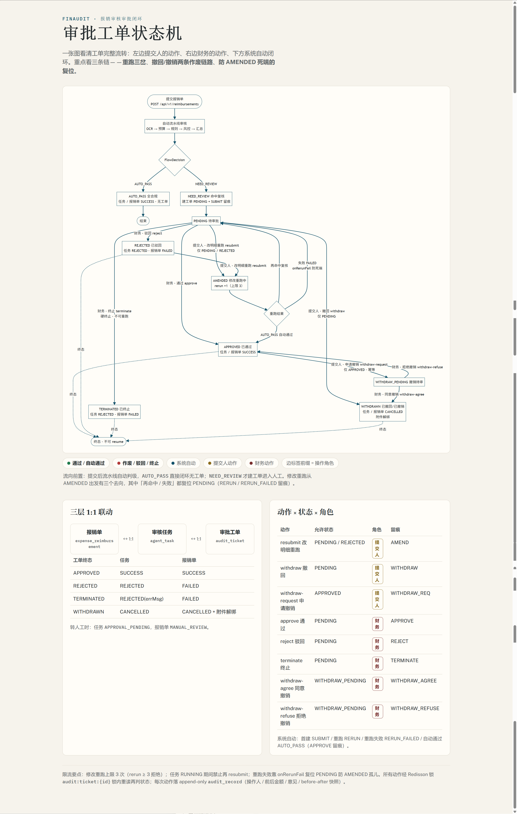

# FinAuditAgentPlatform · Financial Expense Audit Agent Platform

> **Progress: P0 Foundation ✅ ｜ P1 Core Loop ✅ (5-service integration acceptance passed) ｜ P2 Reimbursement and audit tools ✅ ｜ P3a Multi-agent roles and rule pipeline ✅ ｜ P3b Approval ticket workflow ✅ ｜ P3c planned** · Details in `docs/`

## Overview

A **financial expense audit agent platform** built on Spring Cloud microservices + Spring AI.
It upgrades expense/fee review from manual line-by-line auditing to an intelligent closed loop:
**agent autonomous decomposition → step-by-step execution → tool orchestration → self-correction → human approval on high-risk actions**,
with multi-tenant support, quantifiable evaluation, and full-chain observability.

**Key differentiators**: not a Q&A bot — an engineered agent platform with task breakpoint-resume,
async multi-agent collaboration, layered context governance, approval gateway and audit trail.

## Features

### Delivered (P1)

- **Agent task loop**: task persistence + state machine (`PENDING → RUNNING → SUCCESS / FAILED`) + breakpoint-resume + RabbitMQ async orchestration
- **Model integration**: DeepSeek (Spring AI), dynamic tool-catalog injection into the planning prompt
- **Multi-tenant + auth**: logical tenant data isolation + RBAC + JWT session revocation (Redis blacklist)
- **Tool governance**: tool registry + input Schema + dynamic enable/disable, first tool `amount_verify` (Decimal-only money)
- **Service contract**: Feign contracts centralized in common-code + common-feign-starter header/token propagation
- **Minimal frontend**: Vue3 + TypeScript, four pages (login / dashboard / task list / task detail)

### Delivered (P3a: multi-agent roles and rule pipeline)

- Five financial agent roles: document parsing, budget calculation, rule validation, risk auditing, and scheduling
- `REIMBURSEMENT` tasks use a deterministic rule-based pipeline and return `AUTO_PASS` or `NEED_REVIEW` with review reasons
- `APPROVAL_PENDING` marks a task awaiting manual review (large amount / over-limit / risk hit), pausing into the approval stage

### Delivered (P3b: approval ticket workflow)

- **Approval ticket state machine**: full `audit_ticket` lifecycle (PENDING → APPROVED / REJECTED / TERMINATED / AMENDED / WITHDRAWN), append-only `audit_record` audit trail (operator / before-after amounts / comment / before-after data snapshots)
- **Finance actions**: `approve` / `reject` / `terminate` (Redisson lock `audit:ticket:{id}` + in-lock re-read to prevent concurrent overwrite)
- **Submitter amend-and-rerun (resubmit)**: edit items then rerun the same task (max 3 retries; title/deptName locked server-side); rerun `AUTO_PASS` auto-closes / re-hit resets PENDING / failure `onRerunFail` prevents dead-end
- **Withdraw / revoke**: submitter withdraws directly while PENDING; request revocation after APPROVED (`WITHDRAW_PENDING`) → finance agrees (voids) or refuses (reverts)
- **Unified visibility**: finance sees full tenant scope, regular users only their own tickets / reimbursements / tasks

**Approval ticket full workflow (state machine)**



> After submission the pipeline decides: `AUTO_PASS` closes with no ticket; `NEED_REVIEW` creates a ticket for human approval. Amend-and-rerun branches three ways from `AMENDED`; both "re-hit" and "failure" reset to `PENDING` (RERUN / RERUN_FAILED audit). See `docs/architecture/task-orchestration.md`.

### Roadmap (P3c/P4, see `docs/planning/future-roadmap.md`)

- **P3c** Security controls (prompt-injection blocking, output masking, tool authorization)
- **P4** RAG enterprise knowledge base (Milvus), monitoring dashboard, and quantitative evaluation

## Tech Stack

JDK 21 · Spring Boot 3.5.0 · Spring Cloud 2025.0.0 · Spring Cloud Alibaba 2025.0.0.0 · Spring AI 1.1.2 · MyBatis-Plus 3.5.12 · MySQL 5.7 · Redis · Nacos 3.2.2 · RabbitMQ · MinIO · Milvus (P2) · Vue3

## Quick Start

```bash
# 1. Configure environment variables (secrets never committed)
cp .env.example .env
#    set FINAUDIT_MODEL_API_KEY (DeepSeek) and FINAUDIT_JWT_SECRET in .env

# 2. Init Nacos (dev/test namespaces + placeholder configs)
bash docs/deploy/nacos-init.sh

# 3. Init database (finaudit schema + seed data)
mysql -uroot -p < docs/database/finaudit-schema.sql

# 4. Start backend services (requires local middleware: Nacos / RabbitMQ / MySQL / Redis)
cd backend
mvn spring-boot:run -pl agent-gateway       # Gateway 9080
mvn spring-boot:run -pl agent-core-service  # Agent orchestration 9201
mvn spring-boot:run -pl tool-service        # Tool execution 9202
mvn spring-boot:run -pl tenant-service      # Tenant & auth 9203

# 5. Start frontend (dev proxy /api → gateway 9080)
cd frontend && npm install && npm run dev   # http://localhost:5173
```

Seed account: `admin / admin123` (tenant `default`, role `admin`).

> Environment details in `docs/deploy/`, API docs in `docs/api/`, architecture in `docs/architecture/`, phase plans in `docs/planning/`.

## Directory Structure

See `CLAUDE.md` section 4.

## License

Apache License 2.0
