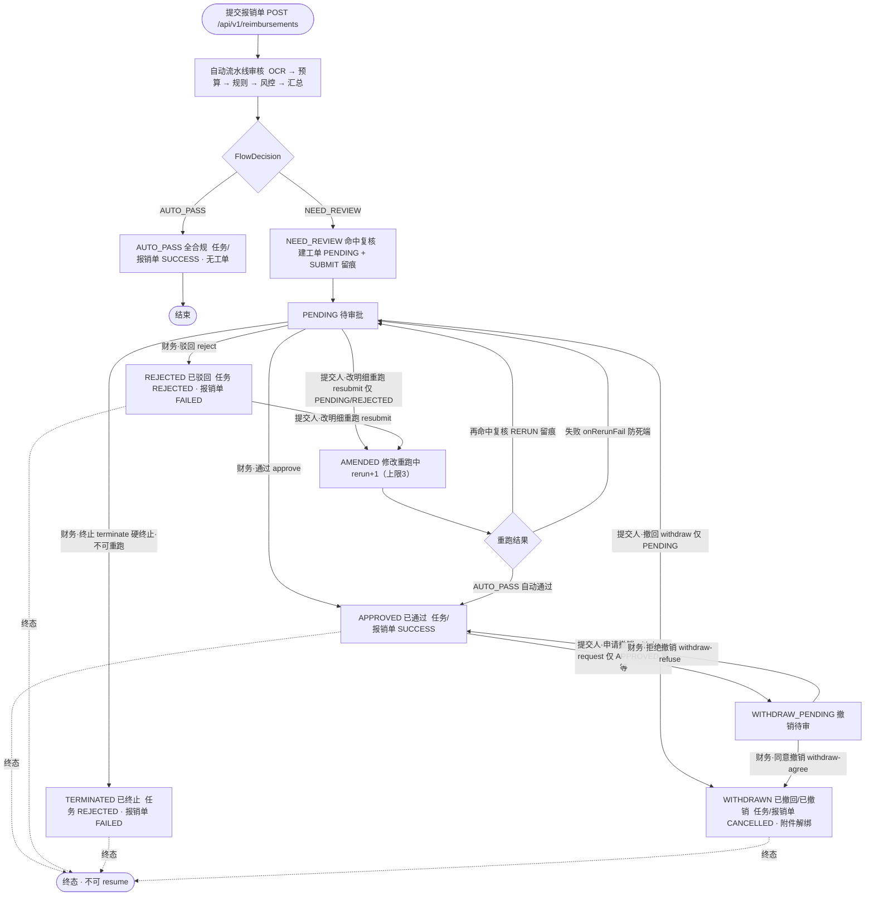

# 任务事件驱动编排（P1.3 / P3a / P3b / P3.8）

> agent-core-service 与 tool-service 之间通过 RabbitMQ 事件驱动协作，任务/步骤全程落库（持久化驱动），支持失败重试与断点续跑。P3a 在此基础上为报销任务增加角色化固定流水线；P3b 增加审批工单闭环（`audit_ticket`/`audit_record` + 三类审批动作 + 提交人 resubmit 修改重跑 + 撤回/撤销 + 快照留痕 + 可见性统一）；P3.8 增加语义自校验与自主纠错、GENERIC 通用分析（与报销同规格收尾）。

## 0. 先说清楚「多 Agent」到底指什么（P3.8 R6-6）

**本项目的「多 Agent」= 单进程内的角色化，不是跨服务的 A2A 多智能体。**

- 五个 `AgentRole`（SCHEDULER / DOCUMENT_PARSER / BUDGET_CALCULATOR / RULE_VALIDATOR / RISK_AUDITOR）
  全部运行在 **agent-core 进程内**，由 `FlowDefinition` 声明的流水线按步骤号依次激活；
- 角色之间**没有**独立进程、独立记忆、消息协议或自主协商，所谓「协作」是
  **共享同一个任务的上下文**（前序步骤输出落库 → 后续步骤与 LLM prompt 读它）；
- 真正跨进程的只有一件事：TOOL 步骤经 RabbitMQ 交给 tool-service 执行（这是「工具调用」而非「Agent 通信」）。

这样取舍的理由：当前业务（报销审核）的正确性来自**确定性规则 + 交叉核验**，
把主链路交给多进程 Agent 协商只会引入不确定性；A2A / spring-ai-alibaba 已登记在
`docs/planning/future-roadmap.md`，等真有跨服务 Agent 需求时再引入。
文档与对外表述一律按此口径，**不要写成「多智能体协同系统」**。

## 1. MQ 拓扑

交换机 `finaudit.task.exchange`（direct，持久化）。三个业务队列 + DLQ，均由 `common-mq-starter` 声明（幂等，两服务一致）。

| 队列 | routing key | 消费者 | 消息 |
|---|---|---|---|
| `finaudit.task.submit.q` | `task.submit` | agent-core | 任务已提交，触发启动 |
| `finaudit.tool.execute.q` | `tool.execute` | tool-service | 执行某工具步骤 |
| `finaudit.tool.result.q` | `tool.result` | agent-core | 工具执行结果，驱动推进 |
| `finaudit.dlq` | `dlq` | — | 失败/不可反序列化消息（死信） |

每个业务队列带死信参数：`x-dead-letter-exchange=finaudit.task.exchange`、`x-dead-letter-routing-key=dlq`，reject 消息自动进 DLQ。

## 2. 消息契约（JSON，共享 DTO 包 `com.finaudit.starter.mq.message`）

| 消息 | 字段 |
|---|---|
| `TaskSubmitMessage` | `taskId, tenantId` |
| `ToolExecuteMessage` | `taskId, stepId, tenantId, toolCode, inputParams` |
| `ToolResultMessage` | `taskId, stepId, tenantId, toolCode, result, success, errorMsg, costTimeMs` |

跨服务反序列化：`Jackson2JsonMessageConverter` + `DefaultJackson2JavaTypeMapper`，trusted packages 须精确到消息 DTO 完整包名，见 `MqTopology.MESSAGE_PACKAGE`。

## 3. 状态机（落库驱动）

任务 `agent_task.status`：`PENDING → RUNNING → SUCCESS / FAILED / APPROVAL_PENDING / REJECTED / CANCELLED`。

- `APPROVAL_PENDING` 由 P3b `AuditTicketService.enterApproval` 在结果分支 `NEED_REVIEW` 时置位，**同时生成审批工单**（`audit_ticket.status=PENDING`，含 `SUBMIT` 留痕）。
- `REJECTED` 为审批驳回/终止后的任务终态：`action(REJECT)` → `markRejected`；`action(TERMINATE)` → `markTerminated`（REJECTED + errorMsg="审批工单终止"）。
- `CANCELLED`（P3b 新增）为撤回/撤销作废后的任务终态：提交人 PENDING 撤回、财务同意撤销时 `markCancelled`；`resume` 拒绝，`onToolResult` 丢弃迟到结果。报销单侧对应新增 `ReimbursementStatus.CANCELLED`，作废单据不再当疑似重复候选、附件解绑可复用。
- 步骤 `agent_task_step.status` 仍为 `PENDING → RUNNING → SUCCESS / FAILED`；TOOL 步骤失败且 `retryCount < 3` 时回 `RUNNING` 重发 `tool.execute`。

## 4. 事件流时序

通用 `GENERIC` 任务由 `TaskPlanner` 进行 LLM JSON 规划；`REIMBURSEMENT` 任务由 `RuleBasedFlowEngine` 按
`FlowDefinition`（P3.8 R6-5 声明化）物化确定性流水线：

`DOCUMENT_PARSER(ocr_extract)` → `BUDGET_CALCULATOR(budget_query)` → `RULE_VALIDATOR(amount_verify/rule_check)` → `RULE_VALIDATOR(invoice_match)` → `RISK_AUDITOR(duplicate_check + 风控语义判断)` → `SCHEDULER(结论汇总)`。

> **工具级顺序（以 `FlowDefinition.reimbursementDefault()` 的 `order` 为准，勿凭记忆写）**：
> `1 ocr_extract` → `2 budget_query` → `3 amount_verify` → `4 rule_check` → `5 invoice_match` → `6 duplicate_check`
> → `7 风控语义判断(LLM)` → `8 审核结论汇总(LLM)`。
> 有附件时 **8 步**（`RuleBasedFlowEngineTest:31-43` 逐条断言 `steps.get(0..7).toolName()`）；
> 无附件跳过 `ocr_extract` 与 `invoice_match`，为 **5 步**（`:56-61`，此时 `amount_verify` 是第 0 步）。
> ⚠️ **`amount_verify` 在 `rule_check` 之前**（金额自洽先判），`invoice_match` 在 `rule_check` **之后**
> （限额已判完，再用票面数据校验明细是否虚报）——`FlowDefinition.java:93-120`。

其中 OCR、预算、票据核验步骤按入参条件生成，工具步骤通过 RabbitMQ 执行，LLM 仅用于风控语义判断与汇总。步骤 `agent_role` 由流水线声明绑定，LLM 不能自由指派角色。执行完成后 `ReviewFlowDecider` 根据规则、风险等级及 `confidence/uncertain` 输出 `AUTO_PASS` 或 `NEED_REVIEW`；后者写入任务结果并置 `APPROVAL_PENDING`。

**收尾闸口（P3.8 R5/R6-1）**：`AUTO_PASS` 判定之前先跑语义自校验（`SelfConsistencyChecker`，5 条确定性断言）。
命中矛盾则重跑风控语义步骤（上限 1 次，矛盾提示注入风控 LLM 步骤入参），超限转人工并附结构化问题项；
自校验轨迹落 `agent_task.result.selfCheckTrace`。**`GENERIC` 任务走同一套闸口与结果分支**，
结论非通过或自校验不一致时同样建审批工单（`trigger_type` 归 `RISK_HIT`）。

```
用户 ──POST /api/v1/tasks──▶ agent-core：落库 PENDING → 发 task.submit
                                  │
  ┌─────── task.submit ──────────┘
  ▼
agent-core TaskSubmitConsumer → Orchestrator.start()
  REIMBURSEMENT → RuleBasedFlowEngine 固定流水线；GENERIC → TaskPlanner.plan()
  → 逐条落库 PENDING → continueTask()
      ├─ LLM 步骤：内联调模型 → SUCCESS → 继续下一步
      └─ TOOL 步骤：发 tool.execute → RUNNING（不阻塞）
                                  │
  ┌─────── tool.execute ──────────┘
  ▼
tool-service ToolExecuteConsumer：租户上下文 → ToolExecutionService（缓存开关 → Redis 同入参缓存 → 注册表校验 → 执行）→ tool.result
                                  │
  ┌─────── tool.result ───────────┘
  ▼
agent-core ToolResultConsumer → Orchestrator.onToolResult()
  成功 → 步骤 SUCCESS → continueTask()
  失败 → retryCount<3 重发；≥3 → 步骤 FAILED → 任务 FAILED
  全部步骤 SUCCESS → 汇总 result → AUTO_PASS 或 NEED_REVIEW
```

**工具执行链的五道关卡（P3c 起，P3.8 R6-2/R6-4 补全为「Schema 进 + 越权守卫 + 执行器 + Schema 出」）**

`ToolRegistryService.execute`（`ToolRegistryService.java:129-154`）是 HTTP 调试直调与 MQ `tool.execute`
**共用**的唯一入口，顺序固定、不可调换：

| 序 | 关卡 | 落点（`ToolRegistryService`） | 行为 |
|---|---|---|---|
| 1 | 编码解析 | `ToolCode.of` `:133` | 非 `ToolCode` 枚举编码直接业务报错（枚举是唯一真相） |
| 2 | 注册表校验 | `findByCode` `:135-139` | 未注册或 `enabled != 1` → `工具未注册或已禁用` |
| 3 | **入参 Schema 校验**（进） | `validateInput` `:141`、`:168-189` | `tool_registry.input_schema` 非空即用 JSON Schema(V7) 强校验；非法入参**在进入执行器前**拦截 |
| 4 | **防越权守卫** | `accessGuard.check` `:148` | 四道校验覆盖双链路（见下表） |
| 5 | 执行器分发 | `executorMap.get(code).execute` `:143-150` | 按 `ToolCode` 取唯一实现，带入 `tenantId` 供 Feign 跨服务取数 |
| 6 | **出参 Schema 校验**（出） | `validateOutput` `:152`、`:200-221` | `output_schema` 非空即校验执行器返回值；无 schema 跳过（兼容存量工具）。出参不符视为**工具自身实现或上游数据**出错，必须让调用方看到——否则错误形状会一路流到 LLM 上下文与结构化问题项（R4-7 手工装配丢字段即此类故障） |

**防越权守卫四道校验（`ToolAccessGuard.check`，`ToolAccessGuard.java:45-55`）**

| 校验 | 适用工具 | 行为 |
|---|---|---|
| **权威租户一致性** | 全部 | 权威租户与声明租户**来源分离**后比对：HTTP 链路权威租户取网关/JWT 派生的 `UserContextHolder`（缺失即由 `ToolController.requireAuthTenant` 拒绝，fail-closed）；MQ 链路无 JWT，改由 `taskId` 经 agent-core 反查**任务真实归属租户**与消息声明比对；两者皆无（内部/单测直调）降级不阻断 |
| **任务归属**（MQ） | 全部（有 `taskId` 时） | 消息被篡改 → 反查不到归属 → 拒绝（防伪造消息跨租户执行） |
| **部门归属** | `budget_query` | `deptName`/`deptId` 二者任一即可（与 Schema 的 `anyOf` 口径一致），两层都缺才拒绝；有凭证（`deptId`/`reimbId`）→ 经 agent-core 校验「预算行 `dept_id` == 报销单 `dept_id`」且部门为真实 `sys_dept`，不通过即拒绝 |
| **单据归属** | `duplicate_check` / `ocr_extract` / `invoice_match` | 入参 `reimbId` 须属于当前租户（经 agent-core 反查归属租户），防操作他租户单据 |

> **安全语义别低估**：工具边界不只是「执行一段逻辑」，而是**入参契约 → 越权判定 → 执行 → 出参契约**四段闭环；
> 入参与出参都有 Schema（P3.8 R6-4 起对称），越权守卫在**分发之前**，
> 因此「危险入参」根本到不了执行器。详细契约见 [`docs/api/tool-service.md`](../api/tool-service.md)。

P3b 审批工单闭环**不改变上述任务/工具 MQ 契约**，仅在结果分支接入：

```
ReviewFlowDecider 输出 AUTO_PASS ──▶ closeOnAutoPass(task)     （AMENDED 工单 → APPROVED + 留痕）
ReviewFlowDecider 输出 NEED_REVIEW ─▶ enterApproval(task, ...)  （建工单/复位 PENDING + SUBMIT/RERUN 留痕）
                                        task.status = APPROVAL_PENDING，流水线暂停

审批/撤销动作为**锁内重读**：Redisson 锁 `audit:ticket:{id}`，锁内 getRequired 重读工单再校验，动作间互斥、无丢失更新。

财务动作（**鉴权 = `@RequirePerm("audit:approve")` + 网关 JWT/Redis 权限快照**，口径见本节末）
  approve  → 工单 APPROVED；任务 markSuccess → SUCCESS；报销单 SUCCESS（仅 PENDING）
  reject   → 工单 REJECTED；任务 markRejected → REJECTED；报销单 FAILED（仅 PENDING）
  terminate→ 工单 TERMINATED；任务 markTerminated → REJECTED(errorMsg)；报销单 FAILED（仅 PENDING）
  withdraw-agree   → 工单 WITHDRAWN；任务/报销单 CANCELLED + 附件解绑（仅 WITHDRAW_PENDING）
  withdraw-refuse  → 工单回 APPROVED（仅 WITHDRAW_PENDING）

提交人动作（createdBy，锁内校验本人；**不挂权限码**）
  resubmit 修改重跑（仅 PENDING/REJECTED）→ 工单 AMENDED(rerun_count+1，>3 拒绝，不动 auditorId)
              + 报销单全量覆盖（title/deptName 强制取库内旧值）+ Σitems 服务端重算
              + replan 全量重建步骤 + markPlanned 刷新 totalSteps
              → Controller 事务提交后 continueTask(taskId) 重跑 → 再次分支判定：
                  AUTO_PASS → 工单 APPROVED（留痕自动通过）
                  NEED_REVIEW → 工单复位 PENDING（刷新 review_reasons/trigger/risk_desc + RERUN 留痕）
                  重跑 FAILED → onRerunFail 复位 PENDING + RERUN_FAILED 留痕（防孤儿工单）
  withdraw 撤回（仅 PENDING）→ 工单 WITHDRAWN；任务/报销单 CANCELLED + 附件解绑 + WITHDRAW 留痕
  withdraw-request 发起撤销（仅 APPROVED）→ 工单 WITHDRAW_PENDING + WITHDRAW_REQ 留痕（幂等防双击）

每次动作追加 audit_record（操作人/前后金额/意见/时间 + before_data/after_data 快照，
`ReimbursementService.buildSnapshot` 不含 OSS 路径/预签名 URL、日期转字符串），工单详情可查完整留痕。
```

**财务动作的鉴权口径（P3.5 起，勿再写「X-User-Roles 含 admin/auditor」）**

| 层 | 机制 | 落点 |
|---|---|---|
| 主防线 | 五个财务动作端点全部挂 `@RequirePerm("audit:approve")`；`PermissionInterceptor` 校验**权限码**（取自网关注入的 `X-User-Perms`，Redis 权限快照为权威），无权 → HTTP 403 + `{"code":403,"message":"无权限访问"}` | `AuditTicketController.java:71,80,89,98,107`；`PermissionInterceptor.java:53-70` |
| 服务层兜底 | `AuditTicketService.action` 在 Redisson 锁内再验一次 `UserContextHolder.hasPerm("audit:approve")`，防内部直连/遗漏调用（fail-closed） | `AuditTicketService.java:510-513` |
| 审计留痕 | 操作人**角色 CSV**（`UserContext.getRoles()`：快照命中用快照角色、否则 JWT claims 降级）仅用于写 `audit_record.operator_roles`，**不再作为鉴权依据** | `AuditTicketController.rolesOf`（`:123-126`） |

> 因此「角色是 admin/auditor 才能审批」是**过时表述**：实际判据是权限码 `audit:approve`；
> 种子数据把该码授予 `admin`（全量）与 `auditor`（财务业务资源级）两个内置角色
> （`finaudit-schema.sql:559-567`）——角色只是权限码的**载体**，
> 自定义角色授予同码同样可审批（这正是 P3.5 资源级 RBAC 的目的）。
> 读权限同理：工单 page/detail/records 非 `audit:viewAll` 持有者按 `createdBy` 过滤
> （`AuditTicketController.java:45-66`、`AuditTicketService.java:280-284`）。

**审批工单状态机（整页图为主，mermaid 实时版 + ASCII 兜底）**

> 完整整页版（含图 + 三层联动表 + 动作矩阵 + 限流要点，带排版配色）见 `docs/images/audit-ticket-workflow.png`；下方为可内嵌实时渲染的 mermaid 版与最保守的 ASCII 骨架。


> 怎么读：从 `PENDING` 发散四条人工边；重点抓两条作废链路（左：提交人 PENDING 撤回；右下：APPROVED 后申请撤销→财务同意）与 `AMENDED` 重跑三岔（自动通过/再命中/失败，后两路都复位 PENDING）。

> 怎么读：从 `PENDING` 发散四条人工边；重点抓两条作废链路（左：提交人 PENDING 撤回；右下：APPROVED 后申请撤销→财务同意）与 `AMENDED` 重跑三岔（自动通过/再命中/失败，后两路都复位 PENDING）。



**ASCII 状态骨架（双仓兜底，Gitee 不渲染 mermaid 时阅读）**

```
                ┌─AUTO_PASS──▶ 无工单闭环（任务/报销单 SUCCESS）
提交 ─▶ 流水线 ─┤
                └─NEED_REVIEW─▶ 建工单 PENDING
                                   │　提交人 撤回 ──▶ WITHDRAWN（CANCELLED+解绑）★仅PENDING
                                   │　提交人 改明细重跑 ─▶ AMENDED（rerun+1≤3）
                                   │　　　├ AUTO_PASS ─▶ APPROVED
                                   │　　　├ 再命中复核 ─▶ PENDING（RERUN 留痕）
                                   │　　　└ 失败 ─▶ PENDING（RERUN_FAILED 防死端）
                                   │　财务 通过 ──▶ APPROVED（SUCCESS）
                                   │　财务 驳回 ──▶ REJECTED（FAILED）→提交人可重跑
                                   │　财务 终止 ──▶ TERMINATED（FAILED）★硬终止
     APPROVED ─ 提交人 申请撤销 ─▶ WITHDRAW_PENDING
                                   ├─ 财务 同意撤销 ─▶ WITHDRAWN（CANCELLED+解绑）
                                   └─ 财务 拒绝撤销 ─▶ 回 APPROVED
```

**按角色完整执行路径（业务语义走查，主文档见 `ProjectBusiness.md` §二.7）**

普通用户（createdBy，锁内校验本人）：
- `PENDING`：`withdraw` 撤回 → WITHDRAWN（任务/报销单作废 + 附件解绑）；`resubmit` 改明细重跑 → AMENDED（rerun<3）→ 三岔：重跑 AUTO_PASS → 自动 APPROVED；再命中复核 → 复位 PENDING（RERUN 留痕）；重跑 FAILED → `onRerunFail` 复位 PENDING（RERUN_FAILED 留痕，防死端）
- `REJECTED`：仅 resubmit 重跑
- `APPROVED`：`withdraw-request` 申请撤销 → WITHDRAW_PENDING（等财务决定）
- `AMENDED` / `WITHDRAW_PENDING` / `WITHDRAWN` / `TERMINATED`：只读

财务（**`@RequirePerm("audit:approve")` 持有者**，种子中为 admin/auditor 两角色；`allowedByStatus` 仅放行 PENDING 与 WITHDRAW_PENDING）：
- `PENDING`：approve → APPROVED / reject → REJECTED / terminate → TERMINATED
- `WITHDRAW_PENDING`：withdraw-agree → WITHDRAWN（作废 + 解绑）/ withdraw-refuse → 回 APPROVED

读权限：工单 page/detail/records 非 `audit:viewAll` 持有者按 `createdBy` 过滤，持有者看租户全量（租户隔离由多租户拦截器保证）。

## 5. 失败重试

- 工具执行异常（业务校验失败 / 工具未启用 / 执行异常）→ `tool.result.success=false`
- agent-core 侧 `MAX_RETRY=3`：每次重试 `retryCount+1` 并重发 `tool.execute`；3 次后步骤/任务 FAILED
- 每队列消费者 `default-requeue-rejected=false`，异常消息进 DLQ，不无限重投
- 重试间隔：当前为即时重发（无退避），后续可加延迟重试

## 6. 断点续跑

`POST /api/v1/tasks/{id}/resume`：

| 任务状态 | 行为 |
|---|---|
| `PENDING` | 完整启动（规划 + 执行）——覆盖 submit 消息丢失场景 |
| `RUNNING` | 残留 `RUNNING` 步骤重置为 `PENDING`，从首个非 SUCCESS 步骤续跑——覆盖服务重启场景 |
| `SUCCESS/FAILED/APPROVAL_PENDING/REJECTED/CANCELLED` | 400 拒绝（任务已终结；待审批任务走审批工单页，resubmit 由 Controller 在事务提交后自动触发续跑，无需手动 resume） |

> 前端「续跑」按钮仅对 `PENDING`（未启动）任务展示；`RUNNING` 执行中不暴露——避免误触强制重置在途步骤并重驱流水线；卡死 RUNNING 的手动恢复暂走接口层（TODO：服务端陈旧任务检测）。

## 7. Redis 缓存

`tool:exec:{tenantId}:{toolCode}:{SHA-256(入参JSON)}`，TTL 1h。同租户同入参命中直接返回。

> **Key 必须含租户前缀**（P3.8 R6-3）：此前 Key 不含租户，两个租户传同一入参会互相命中对方结果。
> 缓存开关按 `tool_registry.cacheable` 判定（有状态查询工具为 0，跳过读写避免被旧结果截断）；
> Redis 读写均 try/catch 降级——读失败直连执行、写失败不影响结果回吐
> （`ToolExecutionService.java:108-111,171-191`）。
